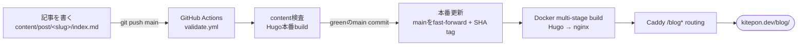

<p align="center">
  
</p>

# WebAICoding

[](https://github.com/kitepon-rgb/WebAICoding/actions/workflows/validate.yml)
[](LICENSE)
[](https://gohugo.io/)
[](https://kitepon.dev/blog/)

[English](README.md) · **日本語**

> **Claude MAX ユーザーが、AI コーディングを実際に使いながら学んだことを記録する技術ブログ。**
> プログラマーではない人間が、趣味の AI コーディングで実際にハマったこと・うまくいったこと・失敗したことを、Copilot → Cursor → Claude Code と渡り歩きながらそのまま書き残している。このリポジトリは、`kitepon.dev`のコンテンツとして配信する Hugo サイトのソース。

**ライブサイト → https://kitepon.dev/blog/**

## これは何

プログラマーでは **ない** 人間が、趣味で AI コーディングをしながら書いているブログのソースです。開発スタイルは「アーキテクト型」— 設計と方針は自分で決めて、実装は AI に任せてレビューする。コードを直接手で書くタイプではありません。記事は日本語で、実運用ベースの内容です。

- GitHub Copilot → Cursor → **VS Code + Claude Code + MAX プラン** に落ち着くまでの実体験
- メモリシステム、トークン節約、サーバー管理、自作アプリのリリースなど、実運用ベースの記事
- 実際に毎日使ってみないと出てこない、ハマりどころ・うまくいったこと・失敗の正直な記録

記事は `content/post/` 以下に Markdown で置いてあり、`main` ブランチへの push で GitHub Actions がcontent pipelineとHugo本番buildを検査します。本番は`kitepon.dev`のCaddy配下にある専用nginx containerから配信します。

## 技術構成

| 項目 | 内容 |
| --- | --- |
| 静的サイトジェネレーター | [Hugo](https://gohugo.io/)（extended） |
| テーマ | 自前（`layouts/` + `assets/` に内蔵。外部テーマ不使用） |
| PC記事プロモーション | 記事の左右ガターに自作Ad Studioレールを、初期表示からフッター1個分だけ上へ固定表示 |
| ホスティング | Caddyの`/blog*` routing配下にある非root nginx container |
| 検証 | GitHub Actions（`.github/workflows/validate.yml`） |
| 本番image | multi-stage [Dockerfile](Dockerfile) |
| 言語 | 日本語 |

## デプロイの流れ



`draft: false` の記事だけが本番に公開されます。

## ローカルで動かす

Hugo extended が必要です（[インストール手順](https://gohugo.io/installation/)）。

```bash
# クローン（テーマ submodule は不要 — テーマはこのリポジトリ内）
git clone https://github.com/kitepon-rgb/WebAICoding.git
cd WebAICoding

# 開発サーバーを起動（http://localhost:1313/）
hugo server -D

# 本番ビルド（出力は public/）
hugo --minify
```

## 記事を書く

```bash
# 新しい記事の雛形を作成
hugo new content/post/your-slug/index.md
```

frontmatter の例（既存記事に合わせる）:

```yaml
---
title: "記事タイトル"
date: 2026-06-03
draft: true
description: "一覧やSNSカードに出る要約"
tags: ["Claude Code", "AI Coding"]
cover:
  image: "cover.png"
---
```

各記事には `cover.png`（1250×500）が必要です。リポジトリ内のツールで生成します（OS非依存＝どのマシンのクローンでも同じ画像になる）:

```bash
cd tools/cover
npm ci && npx playwright install chromium    # 初回のみ
node generate-cover.js "タイトル1行目" "タイトル2行目" "../../content/post/your-slug/cover.png"
```

デザイン仕様や詳細は [tools/cover/README.md](tools/cover/README.md) を参照。

`draft: false` にしてから公開します。`main` へのpushは検証だけを起動し、それ自体では
デプロイしません。検証成功後に本番環境で対象commitへfast-forwardし、そのSHAをimage tagにして
専用blog containerをbuild・更新します。

## ディレクトリ構成

```
content/        記事（Markdown ページバンドル）と About ページ
layouts/        自前テーマ — baseof / list / single
                _default/_markup/render-image.html  （本文画像を <figure> ＋キャプションで包む）
                shortcodes/linkcard.html            （OGP 風リンクプレビューカード）
assets/css/     スタイルシート（ビルド時に fingerprint ＝キャッシュ破棄）
static/         ファビコン・OG 画像などの静的ファイル
hugo.toml       サイト設定
tools/cover/    カバー画像ジェネレータ（Playwright → 1250×500 PNG）
```

各記事は本文に図・スクショ・図解・表・リンクカードを配置しています。本文画像はすべて実物ソース（アプリのスクショ、ブランド調の HTML→PNG 図版、生成イラスト）由来で、モデルが手描きしたものは使わず、フル画質で配信しています。

## ライセンス

[MIT License](LICENSE) — © 2026 kitepon-rgb
