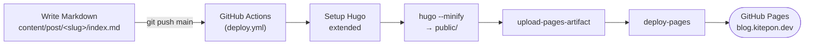

<p align="center">
  
</p>

# WebAICoding

[](https://github.com/kitepon-rgb/WebAICoding/actions/workflows/deploy.yml)
[](LICENSE)
[](https://gohugo.io/)
[](https://kitepon-rgb.github.io/WebAICoding/)

**English** · [日本語](README.ja.md)

> **A hands-on Japanese tech blog about everyday AI coding with Claude Code.**
> A non-programmer hobbyist writes down what actually worked, what broke, and what they learned while building software with AI — Copilot to Cursor to Claude Code. This repo is the source: a Hugo static site that auto-deploys to GitHub Pages.

**Live site → https://blog.kitepon.dev/**

## What it is

The blog is written by someone who is **not** a programmer and codes purely as a hobby. The development style is "architect mode": the author decides the design and direction, then lets the AI implement and reviews the result rather than writing code by hand. Posts are written in Japanese and cover real, in-production experience:

- The journey from GitHub Copilot to Cursor to settling on **VS Code + Claude Code + the MAX plan**
- Practical write-ups: memory systems, token diets, home-server management, and shipping self-made apps
- Honest accounts of the traps, wins, and failures — the kind of detail you only get from actually using the tools daily

Articles live as Markdown under `content/post/`. Every push to `main` triggers GitHub Actions, which builds the site with Hugo and deploys it to GitHub Pages.

## Tech stack

| Component | Choice |
| --- | --- |
| Static site generator | [Hugo](https://gohugo.io/) (extended) |
| Theme | Custom, hand-built (lives in `layouts/` + `assets/`; no external theme) |
| Hosting | GitHub Pages |
| Deploy | GitHub Actions (`.github/workflows/deploy.yml`) |
| Content language | Japanese |

## How it deploys



Only articles with `draft: false` are published.

## Run locally

You need **Hugo extended** ([installation guide](https://gohugo.io/installation/)).

```bash
# Clone (no theme submodule needed — the theme lives in this repo)
git clone https://github.com/kitepon-rgb/WebAICoding.git
cd WebAICoding

# Start the dev server (http://localhost:1313/)
hugo server -D

# Production build (output goes to public/)
hugo --minify
```

## Writing a post

```bash
# Scaffold a new article
hugo new content/post/your-slug/index.md
```

Front matter (match the existing posts):

```yaml
---
title: "Post title"
date: 2026-06-03
draft: true
description: "Summary shown in the list and social cards"
tags: ["Claude Code", "AI Coding"]
cover:
  image: "cover.png"
---
```

Each post needs a `cover.png` (1250×500). Generate it with the in-repo tool — OS-independent, so any clone produces the same image:

```bash
cd tools/cover
npm ci && npx playwright install chromium    # first time only
node generate-cover.js "Title line 1" "Title line 2" "../../content/post/your-slug/cover.png"
```

See [tools/cover/README.md](tools/cover/README.md) for the design spec and details.

Set `draft: false` to publish. Pushing to `main` deploys automatically.

## Layout

```
content/        Articles (Markdown page bundles) and the About page
layouts/        Custom theme — baseof / list / single
                _default/_markup/render-image.html  (wraps body images in <figure> + caption)
                shortcodes/linkcard.html            (OGP-style link preview cards)
assets/css/     Stylesheet (fingerprinted at build → cache-busting)
static/         Static files — favicons, OG image, etc.
hugo.toml       Site configuration
tools/cover/    Cover-image generator (Playwright → 1250×500 PNG)
```

Articles are illustrated with in-text figures, diagrams, app screenshots, tables, and link cards. Body images are sourced from real material (app screenshots, brand-styled HTML→PNG diagrams, generated illustrations) — never hand-drawn by the model — and served at full resolution.

## License

[MIT License](LICENSE) — © 2026 kitepon-rgb
