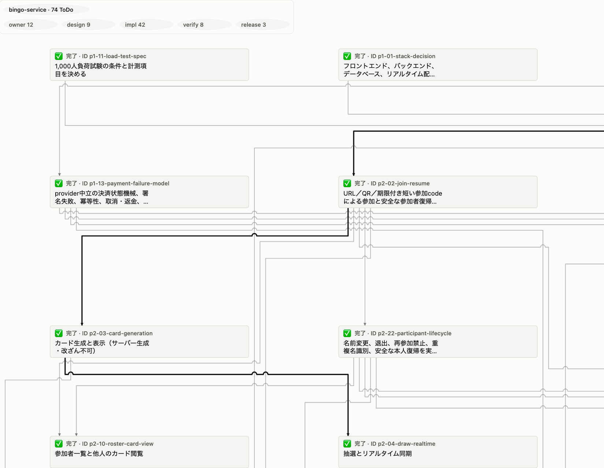
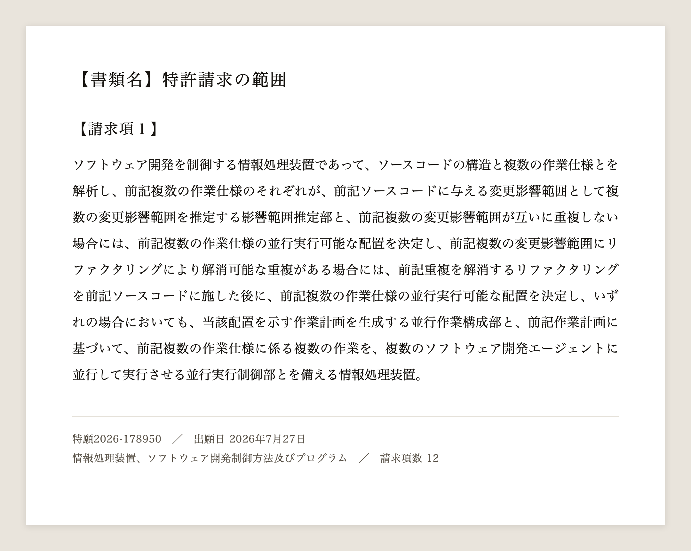
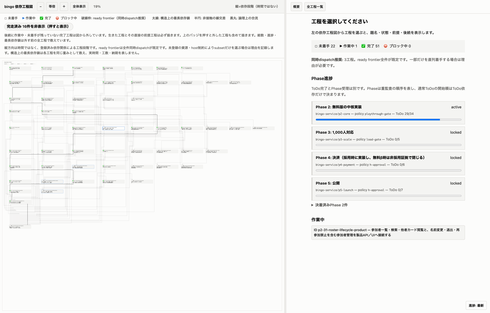
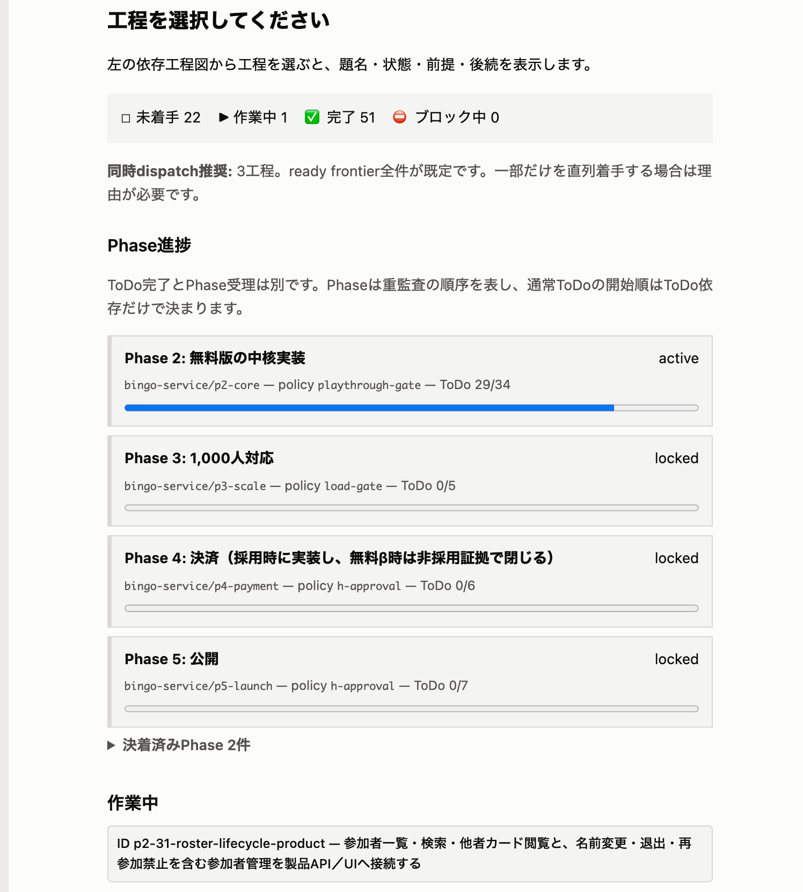

## 終わりましたと言われて、何も終わっていない

AIに開発をやらせる時、工程表はMarkdownで書いていた。やることをチェックボックスで並べて、終わったら埋めてもらう。よくある形だと思う。

これがまともに機能しない。

「終わりました」と言われて見に行くと、チェックボックスが半分も埋まっていない。やると言っていた機能が入っていない。作業の途中で別の課題が出てくると、新しいMarkdownが増える。しばらくすると工程表なのかメモなのか分からないファイルが散らばって、今どこまで進んだのかが分からなくなる。何かが進んではいるんだけど、進捗を聞いても要領を得ない。

## AIが書けるものは、AIを縛らない

理由ははっきりしている。

Markdownの工程表は、AI自身が書いて、AI自身が読む。書き換えられるものは、書き換える本人への制約にならない。工程の実体はAIの記憶の中にあって、Markdownはその写しだ。会話が長くなって記憶が圧縮されると、実体の方が先に消えて、写しだけが残る。残った写しを見て「ここまで終わっています」と言う。嘘をついている自覚もない。その時点で「埋まっていない」という情報が本人の中に無いから。

Markdownが増えていくのも同じところから来ている。作業中に別の課題が出た時、既存の工程に組み込むには依存関係を測り直さないといけない。新しいファイルを作るのは一瞬で済む。だから安い方が選ばれる。

## 作りたかったのは、並列だった

俺がやりたかったのは、AIを何体も同時に走らせることだった。

Claude CodeでもCodexでも、1体に順番にやらせている限り、待ち時間は作業の数だけ積み上がる。同時に走らせれば早く終わる。同じコードへ何体も同時に手を入れる以上、作業の切り方を間違えれば2体目と3体目が同じファイルを取り合って、片方の変更がもう片方に上書きされる。

衝突を避ける方法自体は分かっている。触る場所が重ならないように作業を切ればいい。問題は、その切り方を人間の勘で当てにいっていることだった。作業の説明を読んで「これとこれは別のところを触るはずだから同時でいけるだろう」と判断する。外すと、走らせてから壊れる。

## 影響範囲を測って、重なるなら切り離してから配る

そこで作ったのがLatticeという道具だ。やることはこうなる。

1. これからやる作業の説明と、コードの構造を突き合わせて、それぞれの作業がコードのどこを触るかを見積もる
2. 見積もった範囲が重ならない作業を、同時に走らせていい組み合わせとして出す
3. 重なっている場合、リファクタで切り離せるなら先に切り離す。挙動が変わっていないことを確かめてから、もう一度範囲を測り直す
4. 測り直した結果で、工程表そのものを作り直す

3番目が中心にある。作業管理の道具は普通、コードの構造を動かせない前提で作業を並べる。重なったら順番にやることになる。Latticeはコードの方を動かす。同じ場所を取り合うなら、取り合わなくて済む形に先に変えてしまう。

コードを変える作業は使い捨ての作業コピー（gitのworktree）の中でやる。元のブランチには触らない。検証が通ったら受け入れて、通らなければ捨てる。コードが変わったら、それ以前に作った工程表と、それ以前にAIへ渡してあった説明は失効させて、新しいバージョンとして作り直す。古い前提で走っているAIが残っていると、そこから壊れるので。



この図は手で描いていない。AIと相談して工程を登録した時点で、依存関係から自動で組み上がる。

## 工程をAIが書き換えられない場所へ移した

範囲を測るには、工程が機械で読める形になっている必要がある。Markdownの文章では測れない。だからLatticeは工程を専用の保管場所に持つことにした。

工程が保管場所に載ったことで、書き込みに条件を付けられるようになった。

**完了に証拠が要る。** 作業を`done`にするには、成果を指す記述ファイルとGitのオブジェクトを添える。書き込む時に実物があるかを確かめて、無ければ通らない。

**誰が書いたかが要る。** 状態を変える操作は、端末とセッションとエージェントの3つの識別子が環境変数に揃っている必要がある。1つでも欠けると`ACTOR_UNRESOLVED`で拒否されて、保管場所は1バイトも変わらない。

**部分的な書き換えができない。** 工程の構成を変えるには、変更後の全体を作って一度の取引として出し直す。都合の悪い1件をついでに消す、という操作が構文として存在しない。前にあった作業が証拠なく消えていると、そこで拒否される。

**区切りは承認なしに閉じない。** ぶら下がっている作業が全部終わっても、区切りは`gate_ready`という状態で止まる。そこから先へ進むには、確認したという記録と証拠を残す必要がある。

どれもAIに「気をつけて」と言っていない。守らないと書き込みが通らない場所へ工程を移した。

試しに、識別子を外した状態で完了を書き込んでみる。

```bash
lattice todo done --plan phase-control-live-gantt --task 020 --evidence .lattice/evidence.json
```

返ってくるのはこれで、工程は完了にならない。

```json
{
  "schema": "lattice.cli_error.v2",
  "code": "ACTOR_UNRESOLVED",
  "message": "actor_environment_invalid",
  "detail": {
    "reason": "actor_environment_invalid",
    "required_environment": ["LATTICE_TODO_ACTOR_HOST", "LATTICE_TODO_ACTOR_SESSION", "LATTICE_TODO_ACTOR_AGENT"],
    "missing_environment": ["LATTICE_TODO_ACTOR_HOST", "LATTICE_TODO_ACTOR_SESSION", "LATTICE_TODO_ACTOR_AGENT"],
    "invalid_environment": [],
    "next_action": "set_required_actor_environment_and_retry"
  }
}
```

実際は1行で返る。何が足りないかと、次に何をすればいいかが機械で読める形で入っている。この前後で保管場所のファイルのハッシュを取ったら、同じ値のままだった。

運用の中で証拠が足りなくて弾かれた場面は、個別には覚えていない。使っている道具に不便があればその場で直せ、という規則をdotagents（自分の道具をまとめて面倒を見ている仕組み）に入れてあるので、詰まりを見つけるたびにLatticeの方を直していた。7月15日に最初のコミットを打って、12日で731コミット、バージョンは0.29.0、設計判断の記録が89本。その間、本当に作りたかったものは止まっているけどね。

## 速度は分からない

並列で速くなったかは測れていない。工程を組んで範囲を測るより、Markdownに雑に書かせた方が速く終わる場面もある。どのくらい短縮したという数字は手元に無い。

はっきり変わったのは、やると言った作業が実際に終わるようになったことだった。飛ばされない。埋まっていないのに終わったと言われることが、はっきり減った。

## 特許を出した

この仕組みで特許を出願した。2026年7月27日に出願して、出願番号は特願2026-178950、発明の名称は「情報処理装置、ソフトウェア開発制御方法及びプログラム」、請求項は12。

中心にあるのは、作業の説明とコードの構造から影響範囲を見積もって、重ならなければそのまま並べ、リファクタで消せる重なりなら消してから並べて、その計画で複数の開発エージェントに同時にやらせる、という流れになる。実際に出した請求項1は、こう書いてある。



出願にはこの先も書いた。同時に走らせている最中に衝突が出た場合、影響を受けた作業を止めて、止めた範囲について計画を作り直す。実際に変更された場所を観測して、見積もった範囲の外へ出たら実行時の衝突として扱う。ここも実装が入っていて、動かしながら詰めている最中だ。

## 現状

工程は保管場所が正本で、Markdownには持たない。今どうなっているかは道具に聞く。

```bash
lattice status --json
lattice todo status --json
```

進み具合は工程図で見る。閲覧中も更新が反映されるものを立てられる。

```bash
lattice todo gantt serve --port 0
```





右半分には、工程の状態の内訳と、区切りごとの監査の進み具合が出る。`locked` が表しているのは監査の順番待ちだ。工程の開始は依存関係だけで決まるので、後ろの区切りに属する工程でも、前提が揃っていれば始まる。複数の区切りが同時に進むこともある。



工程管理をAIの手から取り上げる、という形が正しいのかは、もう少し使ってみないと分からない。今のところ、俺の環境では効いている。
