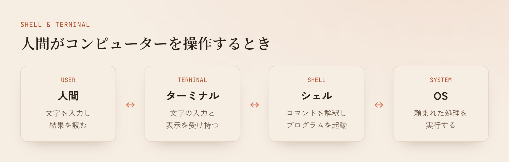
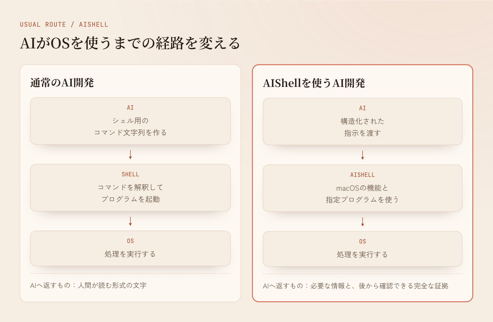

> なあ、AIならシェルもターミナルもいらなくね？

AIShellの開発は、俺がAIにそう話しかけたところから始まった。

シェルとターミナルについては、何となく知っていた。OSがあって、シェルがあって、ターミナルがある。普段から開発で使っているし、それぞれ別のものだという理解もあった。

それが何のために分かれているのか、実感はなかった。

## シェルとターミナルは何をしているのか

改めて調べると、ターミナルは人間が文字を入力し、コンピューターから返ってきた文字を見るためのアプリだった。シェルは入力されたコマンドを解釈し、プログラムを起動してOSへ処理を頼む。

細かな仕組みを省いて図にすると、こんな関係になる。

ターミナルが文字の入出力を受け持ち、その中でシェルが動く。どちらも、人間がコンピューターへ指示を出し、結果を理解するために作られている。

調べてみると、確かにそうだよなと思った。

そして、ふと思った。

**AIなら、シェルすらいらないんじゃないか。**

## 人間向けの変換をAIにも使わせている

AIが通常の開発環境を使うときも、基本的には人間と同じ経路を通る。

AIはやりたいことをシェルの書式へ変換する。実行結果は人間がターミナルで読む形式になり、AIがそれを読み直す。

ここをAI向けに作れば、指示をもっと直接渡せる。結果もAIが次の判断に必要な形で返せる。人間向けの長い表示を毎回読む必要が減るので、使うtokenを減らし、処理も速くできるかもしれない。

長い出力を途中で切れば、返す文字数は減る。必要な行まで消えると、AIは再実行や追加の読み取りを始める。どこを残すかによって結果が変わる方法より、最初から余計な変換を減らす方が根本的に見えた。

面白そうだったので、勉強ついでに作ることにした。GPT-5.6なら多分作れると思っていた。OSを直接扱う仕組みなので、モデルの安全上の判断によって開発できない可能性は少し気にしていた。

## AIShellを作った

作ったものには、そのままAIShellと名前を付けた。Apple Silicon MacとmacOS 15以降で動くSwift製のアプリで、AIとはMCPを使って接続する。



AIShellは、AIから受け取った要求をシェル用の文字列へまとめない。実行するプログラム、引数、作業フォルダを分けて受け取り、macOSの機能を使って直接起動する。ファイル操作もmacOSの機能で扱う。

Git、検索プログラム、コンパイラ、テストなどは、すでに優れたものがある。AIShellはそれらを指定されたプログラムとして直接起動し、実行時間、終了状態、出力を管理する。

AIから見ると、経路はこうなる。

開発中、AIShellがOSへ直接送る命令と、OSから返ってくる情報を見る機会があった。普段ターミナルで見るコマンドと出力とは形式が異なり、AIShellとOSが直接やり取りする情報が並んでいた。

それを眺めていて、こう思った。

> これ理解できねーわwwwww
>
> 読みたくねえwwwww

AIはその命令と返事を使って開発を進めている。不思議な感じがした。同時に、人間には読みづらいものをAIが直接扱えるなら、AIShellを作る意味があるかもしれないと初めて実感した。

現在のAIShellが普段の開発用に公開している機能は5つある。

- 作業フォルダの現在状態と、前回からの変更をまとめて返す
- 複数のファイルから必要な量だけ読む
- 指定された範囲を検索する
- buildやtestを実行し、重要な診断を返す
- 保存してある完全な出力から、必要な範囲を読む

たとえばbuildが216KBの診断を出しても、その全文を毎回AIへ渡さない。AIShellは完全な出力を保存し、通常は主な失敗原因と場所を返す。AIが追加の確認を必要としたときは、保存した出力へ戻れる。

ファイルについても、毎回すべてを調べ直す方法は取らなかった。macOSが通知する変更候補を記録し、現在のファイル情報やSHA-256と照らし合わせて、前回から変わったものを返す。

完全な証拠を残したまま、普段AIへ見せる量を減らす設計にした。

安全性についてもAIShell自身が管理する。人が許可したフォルダだけを操作し、管理アプリから全機能を停止できる。削除はゴミ箱へ送り、ファイルの更新前にはSHA-256で競合を検出する。プログラム実行がファイル更新や通信を行う可能性も、AIを動かす環境へ明示する。

## 数値では効果が出た

作った後、通常のCodexとAIShellを使うCodexへ同じ課題を渡して比較した。

使ったのは、小さなコード変更、大量の診断が出るコンパイル失敗、同じ作業フォルダを繰り返し確認する課題の3つ。それぞれ3回ずつ実行し、両方とも9回すべて成功した。

結果はこうなった。

| 測定項目 | 通常のCodex | AIShell | 変化 |
|---|---:|---:|---:|
| 成功1件あたりのtoken | 144,251 | 106,955 | 25.86%減 |
| 平均時間 | 50.14秒 | 33.80秒 | 32.59%減 |
| 時間の95パーセンタイル | 72.49秒 | 43.54秒 | 39.93%減 |

大量の診断が出る課題では、tokenが36.65%減り、時間は52.01%短くなった。完全な診断をAIShellへ保存し、主な失敗だけをAIへ返す仕組みが最も分かりやすく働いた課題だった。

これは同じ条件に固定した3種類の課題による結果だ。実際の開発全体で25.86%減ることを示す数字ではない。小さな課題では、AIがAIShellを使うかどうかも毎回同じにならなかった。

## AIにシェルとターミナルはいらないのか

まだ分からない。

数値では効果が出た。開発では、まだあまり使えていない。今はdotagentsプロジェクトの開発で実際に使いながら、見つかったバグを直しているところだ。

シェルとターミナルについて何となく知っていた自分が、AIに教えてもらいながらAIShellを作った。それによって、人間がコンピューターを使うための仕組みを初めて実感できた。

最初にAIへ投げた疑問には、まだ答えが出ていない。

> なあ、AIならシェルもターミナルもいらなくね？

今のところは、いらない可能性がある。もう少し使って確かめてみる。
