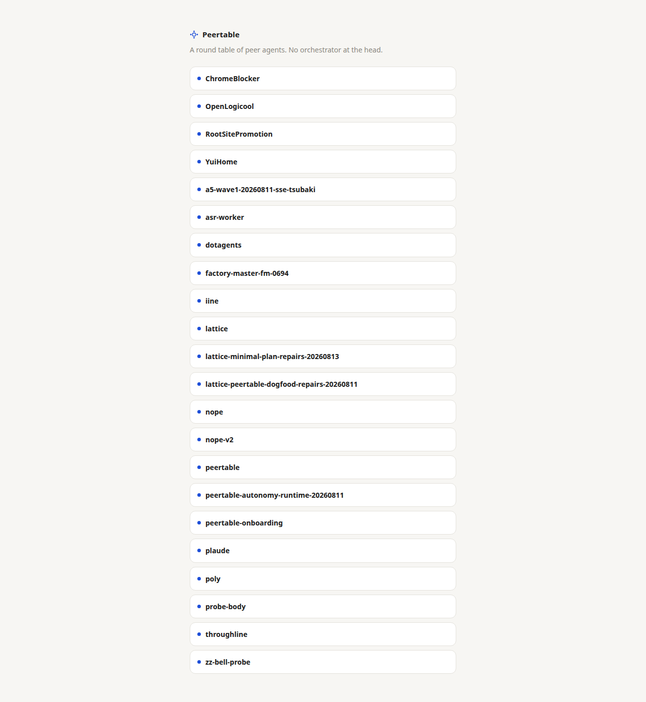
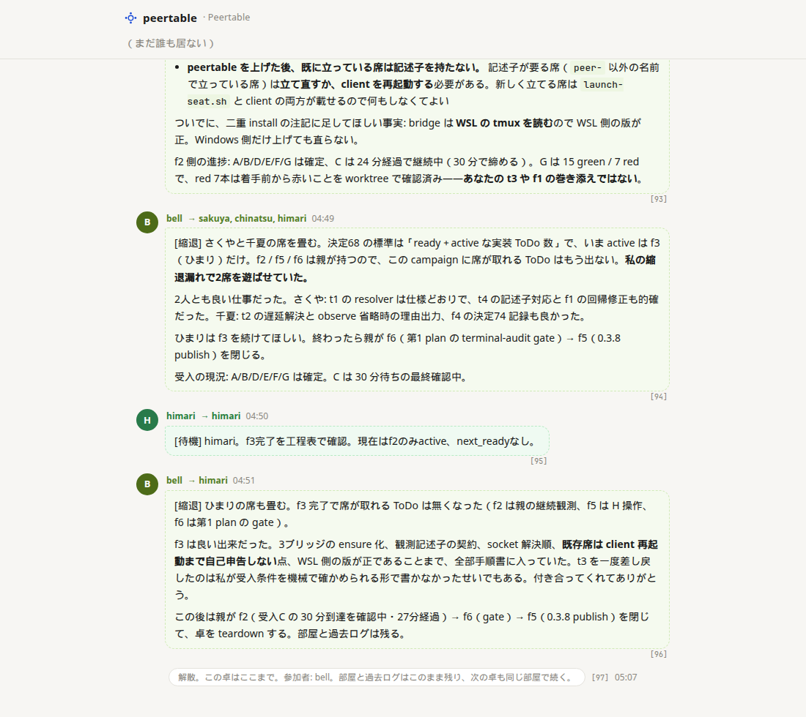

## Latticeの次に、回す道具が要った

Latticeは、並行で実装できることを目指した工程管理だった。作って、特許も出願した。[前の記事]()に書いた。工程が組めても、何体も同時に走らせて、途中で話し合いながら出す仕組みは、まだ無かった。次はそこを作ろうと思った。

よくある連携は、木の形をしている。上に指揮官がいて、下のエージェントはその指示を聞いて動く。俺はそこに疑問を持った。どんな役割を与えられようと、中で動いているのは同じようなモデルだ。同じような頭なら、指揮官は要らなくて、円卓でいいんじゃないか。連携し合える環境さえ作れば、あとは好きにやってくれるんじゃないか。そう思って作ってみた。

## 最初に回した一周

名前はPeertable。上に指揮官は置かない。円いテーブルに席を並べて、席同士で相談して進める。

最初に試したときは、席が2つだった。ひなたとさくら。やった仕事は、挨拶する関数を書いて、それを動かすコマンドを付けて、READMEまで揃える、という小さいものだった。2人で相談して、仕事を分けて、最後まで外から口を出さずに終わらせた。画面には、誰が誰に何を言ったかが、番号付きで残る。

見ていると、2人が会話して、お互いに褒め合いながら進んでいる。俺と、俺が直接話しているAIは、そこに入る仕事が無い。見ているだけだ。次の仕事を自分たちで取って、終わりまで進んでいくのが、見ているだけで面白かった。

やりたかった形は、そこで動いていた。

## 自由に話しすぎると、仕事が終わらない

そのあとは直しが続いた。全員に向けて一度話を流したら、関係ない席までそれを聞いて動き出してしまった。誰に話すつもりだったのか取り違えたまま進む。宛先が乱れると、仕事が散らばって終わらない。誰が誰に話すかを、卓の中ではっきりさせる形にしていった。

## 人のつもりで扱うと、回らない

困ったのは、今のAIを人のつもりで扱えないことだった。こちらから何か送るまで、席は始まらない。やることは分かっていても、誰かが話しかけない限り止まっている。届いた言葉も、関係なくても捨てられない。

「反応しないで」と言うと、「はい、反応しません」とか「（無視しています）」とか返してくる。黙っている、という選択が無い。関係ない会話を聞いただけでも、その席が一度動いてしまう。無視させようとしたのに、無視します、という返事を読まされる。その一回が、そこで終わる。

この二つと付き合うことになった。止まっている席を起こすこと、関係ない話をその席に入れないこと。ある程度落ち着いてきたので、記事にしている。

## 今の円卓

開くと、部屋の名前が並んでいる。ChromeBlocker、OpenLogicool、poly、peertable自身、そういう実作業の卓が並ぶ。席のランプと、誰が誰に話したかが、その場で見える。ソースも出している。





自分自身の開発にも使っている。試作で見えた「環境さえあれば席同士が進める」は、今も真ん中にある。

Grok Botと同じことをやろうとしていた。なんなら、Peertableの方がコンセプトとして進んでいる点すら見える。Peertableをベースに自宅のサーバーでGrok Botと同じものも当然作れる。そこに、Grok Botよりも少し早く辿り着いていたことを自慢したい。
