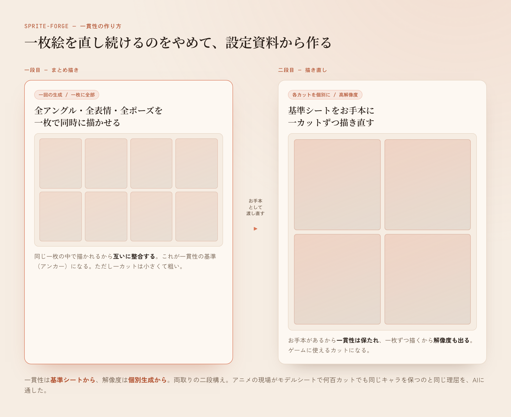
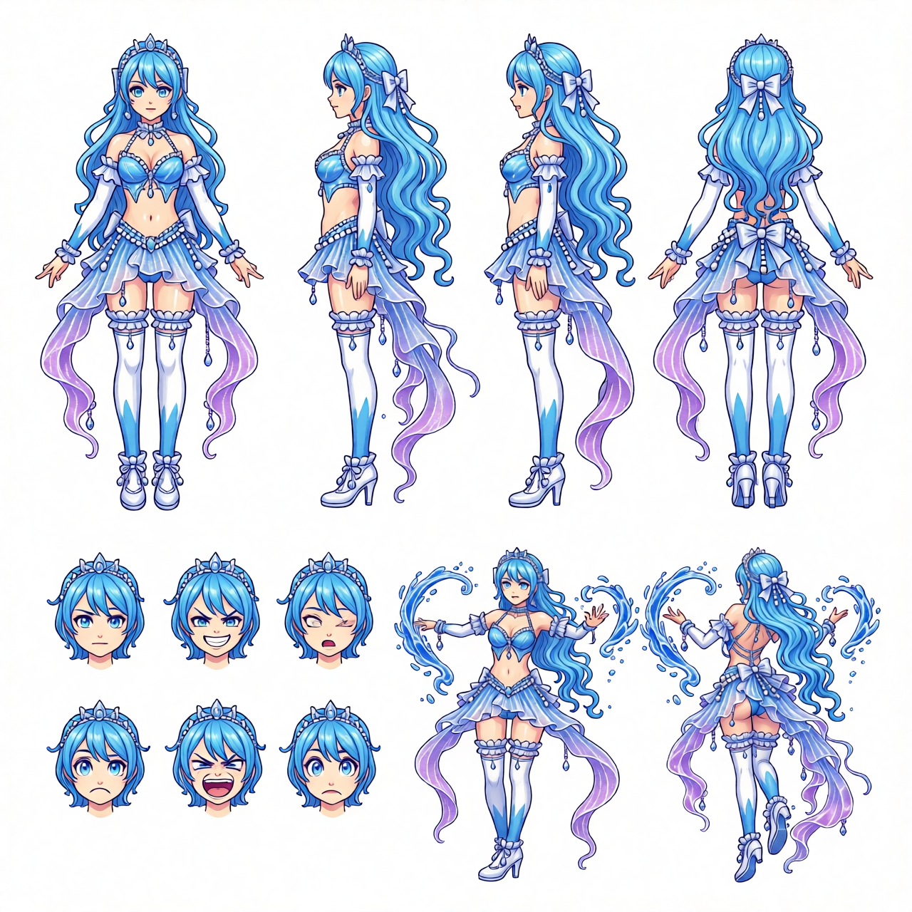
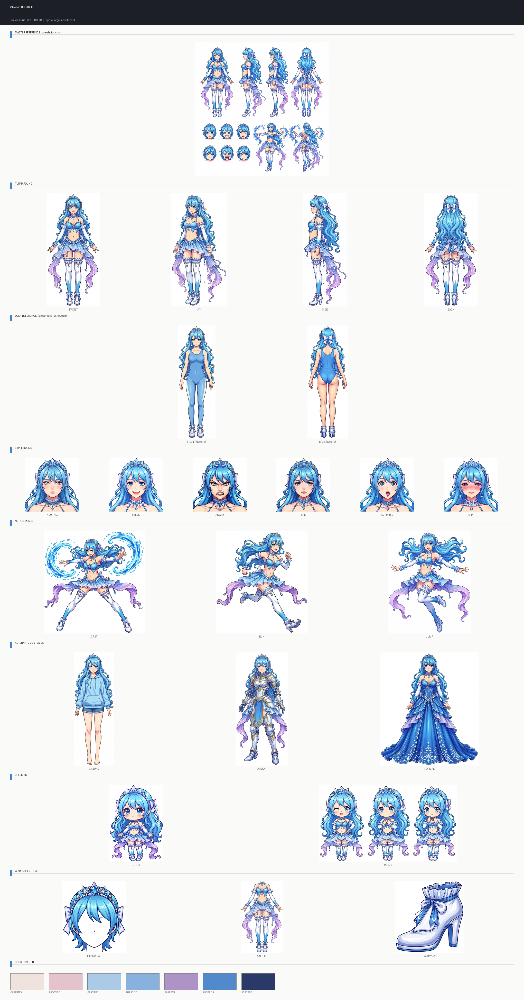
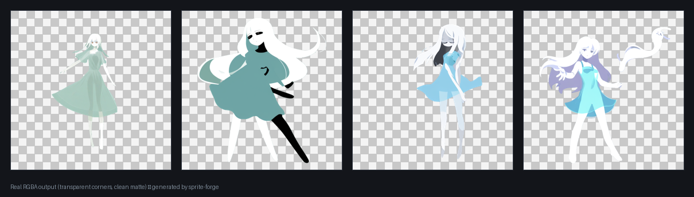

俺は自分のRPG（rpgdev）のキャラを、全部AIに描かせてる。ドット絵の勇者、火・水・風・土の精霊、敵のモンスター。一枚一枚、生成して、透過して、ゲームに入れてきた。

で、ずっと引っかかってた問題がある。**AIは、同じキャラを描き続けるのが苦手だ。**

一枚、いい感じのキャラが描けたとする。それを「同じキャラのまま、向きだけ横にして」とか「ダメージを受けた版にして」と頼む。すると——別人になる、とまでは言わないが、髪型が少し変わる。色がずれる。装備が増えたり減ったりする。輪郭の太さが変わる。一枚ずつ見れば悪くないのに、並べると「同じキャラ」に見えない。

一枚絵を編集してバリエーションを増やす、というやり方は、一貫性の面で信用できなかった。

ちなみに前に書いた[ターミナルをRPGにした話]()で、このドット絵の差分作りに手こずって、32GBのグラボを発注して「再戦する」と書いた。これはその再戦の記録でもある。

---

## アニメや漫画の現場は、どうやって揃えてるのか

考えた。プロのアニメーターや漫画家は、毎カット・毎話で同じキャラを、どうやって揃えてるのか。

答えは知ってる。**キャラクター設定資料（モデルシート）**だ。正面・斜め・横・後ろのターンアラウンド、表情のパターン、いくつかのポーズ。一枚にまとめた「このキャラはこう描く」という基準表。現場の全員が、これを見ながら描く。だから何百カットでも同じキャラでいられる。

だったらAIにも同じことをさせればいい。一枚絵を直し続けるんじゃなくて、**先に設定資料を一枚作って、それを基準に以降を生成する。** 発想自体は単純だ。

問題は、その設定資料を、AI自身にどう作らせるか、だった。

---

## 設定資料の作り方に、肝がある

素直にやると、こうなる。「正面を描いて」「次は横向き」「次は後ろ姿」「次は笑った顔」——とカットを一枚ずつ別々に生成する。

これだと、結局さっきと同じだ。カットごとにキャラがブレる。**設定資料の中で別人になる。** 基準を作るための資料が、基準になってない。本末転倒だ。

そこで考えたのが、二段構えだった。

**一段目。全アングル・全表情・全ポーズを、一回の生成でまとめて一枚に描かせる。** バラバラに頼まない。「ターンアラウンドと表情とポーズが並んだ設定資料を、一枚で」と一発で出させる。一枚の絵として同時に描かれるから、その中では互いに整合する。正面と後ろ姿が、ちゃんと同じ髪型・同じ衣装になる。これが「一貫性の基準（アンカー）」になる。

ただ、一枚に詰め込むと、一カットあたりが小さくて粗い。ゲームに使うには解像度が足りない。

だから二段目。**その"まとめ描き"のシートを、今度は「お手本」としてAIに渡し直す。** そして各カットを一枚ずつ、高解像度で描き直させる。「このお手本に写ってるキャラのまま、この一カットだけを大きく描いて」と。

お手本があるから一貫性は保たれる。一枚ずつ描かせるから解像度も出る。**一貫性は基準シートから、解像度は個別生成から。両取りだ。** この二段構えは自分で設計して指示した。

出来上がりがこれ。上に基準シート、その下に高解像度で描き直したターンアラウンド・表情・アクション・別衣装・ちびキャラ・装備、最後に抽出した配色まで。全部、同じキャラだ。

水の精霊。表情も、走りも跳躍も、騎士鎧もドレスも、全部同じ一人として並んでる。

---

## おまけ：設定資料が、次の量産の燃料になる

二段目で出来た高解像度のカット群には、もう一つ使い道がある。

そのまま「このキャラ専用の学習データ」になる。同じキャラを十数枚、いろんな角度・表情で持ってる状態だ。これをAIに学習させて「このキャラを覚えた小さな追加モデル」を作れば、設定資料に無いポーズでも、そのキャラのまま新規に量産できるようになる。

設定資料を作る工程が、そのまま次の量産の燃料を兼ねてる。狙ってこうした。

---

## 痛みを「関門」に変える

ここまでが軸。あとはツールの中身の話を少しだけ。

rpgdevのアセット作りで、細かい痛みを山ほど踏んできた。それを一つずつ、ツールに「絶対ルール（関門）」として焼き込んである。

| 踏んできた痛み | 焼き込んだ絶対ルール（関門） |
|---|---|
| **透過の黒漏れ**。腕とリボンの隙間みたいな「閉じた黒」が、単純な背景抜きだと残る。採用した一枚に黒が20万px以上残ってたことも。 | 四隅がちゃんと透過してなければ、出荷前に弾く。 |
| **ダメージ版のズレ**。再生成のたびに数pxずれて、ゲーム内でベースと重ならず配置が崩れる。 | ベースと1px以内で一致してなければ弾く。 |
| **画風のドリフト**。レトロなドット絵を指定する必須の語句を抜くと、艶のあるアニメ調にぬるっと滑り落ちる。 | その語句を自動で注入する。 |
| **手作業は効かない**。布や肌や輪郭を手で描き足して直す、の成功率はゼロだった。 | 手描き機能は持たない。直すなら再生成。 |

壊れたアセットが黙ってゲームに紛れ込まない。関門で止まる。

そして、人間が操作する画面（WebUI）と、AI（Claude や Codex）が叩く窓口（MCP）の、どっちから来ても**同じ処理を通る**ように作ってある。だからどっちの顔から入っても、この関門は迂回できない。

---

## 32GBで、ようやく動いた

#30で、自作の差分ツールが手元の16GBのグラボで回らなくて、32GBを発注して「再戦する」と書いた。

このツールが使う編集モデルは、VRAMを20GB以上ごっそり食う。16GBには全然収まらなくて、本当に1枚も出なかった。32GBに積み替えて、ようやく動いた。ここはVRAMが足りなければ、それまでだ。

その上で、本体の作りはこうしてある。重い生成は、その32GBを積んだ一台（ComfyUIのGPU機）が丸ごと引き受ける。本体は「何を、どの順で作るか」の指揮と、さっきの関門の判定に徹する、薄い指揮役だ。生成する一台さえ立てておけば、指揮はMacからでもWSLからでも繋がる。

CUDAのGPUとComfyUI一式が要る、土台のいるツールだ。二段構えという考え方自体は、ツールに依らない。同じキャラが揃わなくて困ってるなら、そこだけ持っていっても効く。

---

## おわりに

sprite-forge。テキストから、透過済みのゲーム用キャラを作る。発想を打てば素体が出て、設定資料が組み上がり、そのキャラの学習データまで揃う。人間でもAIエージェントでも、同じ関門を通って同じものが出る。

リポジトリは [github.com/kitepon-rgb/sprite-forge-mcp](https://github.com/kitepon-rgb/sprite-forge-mcp)。MIT。



一枚絵を直し続けるのをやめて、設定資料から作るようにした。同じキャラが、やっと同じキャラのまま並ぶようになった。
