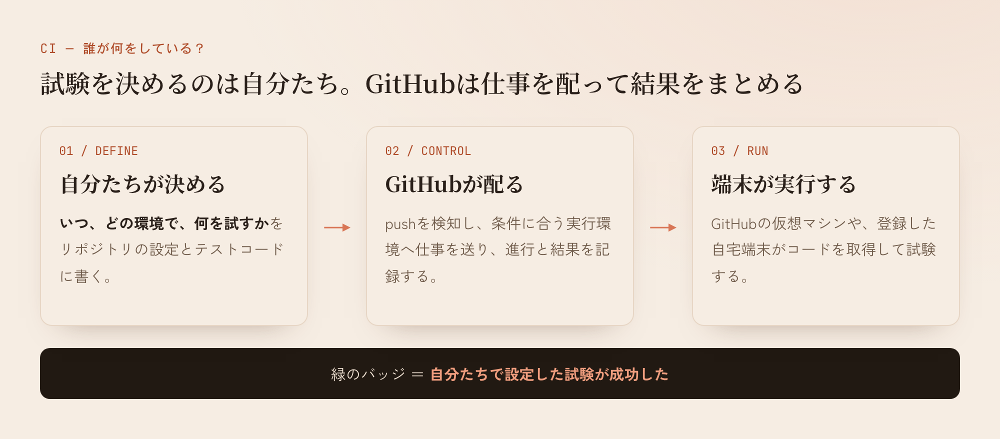
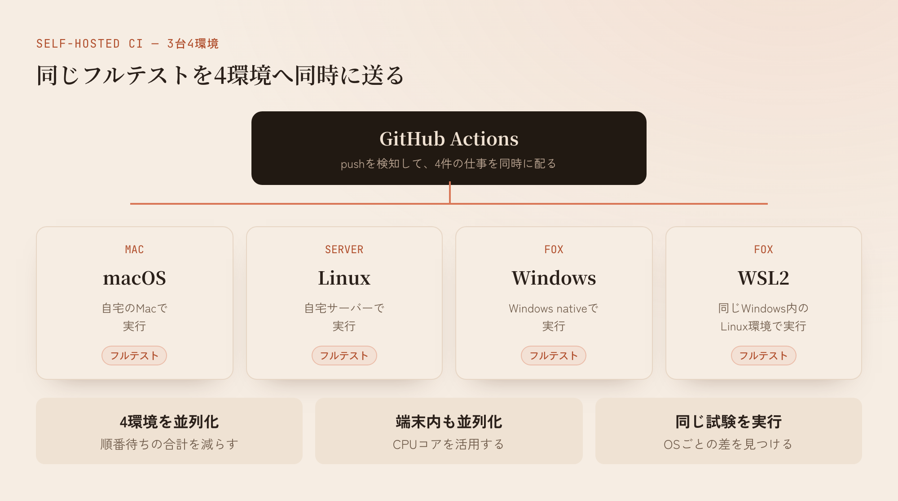

## 最近よく聞くCIって何なんすかね

最近よく聞くCIって何なんすかね。

初心者なりに体験して学んだことを共有するぞ！

AIを使ってアプリや開発道具を作っていると、いつの間にかCIというものが出てくる。俺の場合は、Opus 4.8を使っていた頃からだったと思う。

AIがGitHubで何やら動かしている。コードを確認して、試験して、終わると緑色のバッジが付く。GitHubへ載せる上で、配布してもいいアプリなのかを調べているように見えた。

GitHubからチェックされてんのかな。よく分かんねーな。CIが通ると緑になるなら、うん、じゃあやっとこう。

最初はそんな感じだった。

## CIは、変更するたびに自動で確かめる仕組み

CIは「Continuous Integration」の略で、日本語では継続的インテグレーションと呼ばれている。

コードを変更したら、ほかの変更と組み合わせても動くかを早めに確かめる。そのためにビルドやテストを自動で実行する。問題が見つかったら、変更した直後に分かるようにする。この一連の考え方がCIだ。

GitHubでCIを使う時は、GitHub Actionsという仕組みを使うことが多い。例えばNode.jsで作ったものなら、こんな設定をリポジトリへ置ける。

```yaml
name: CI

on: [push]

jobs:
  test:
    runs-on: ubuntu-latest
    steps:
      - uses: actions/checkout@v6
      - uses: actions/setup-node@v7
        with:
          node-version: 22
      - run: npm ci
      - run: npm test
```

書いてあることは単純だ。

1. コードがpushされたら始める
2. Ubuntuの実行環境を用意する
3. リポジトリのコードを取得する
4. Node.js 22を用意する
5. 必要なパッケージを入れる
6. テストを実行する

全部成功すれば緑になる。途中で失敗すれば赤になる。

[GitHubの公式ドキュメント](https://docs.github.com/en/actions/get-started/continuous-integration)にも、CIの設定は提案されたひな型を調整しても、自分で独自に作ってもよいと書いてある。



## 試験内容を決めていたのは自分たちだった

俺はGitHubが何か決まった試験を持っていて、送られてきたアプリを審査しているように思っていた。

実際に試験内容を決めていたのは、リポジトリにある設定とテストコードだった。俺の環境では、その大部分をAIが作っていた。GitHubは設定を読み、指定された環境で実行し、結果を記録していた。

緑色のバッジが示す範囲も、ここまでになる。

**自分たちで設定した試験が、直近の実行で成功した。**

試験へ書いていないことは確認されない。簡単な試験だけならすぐ緑になる。終わらない試験を書けば、ずっと終わらない。間違った試験を書けば、意味の薄い結果が返ってくる。

あの緑色はGitHubによるアプリの品質認定だと思っていた。使っていくうちに、自分たちが決めた確認項目の実行結果だと分かってきた。

[GitHubのバッジの説明](https://docs.github.com/actions/managing-workflow-runs/adding-a-workflow-status-badge)にも、バッジはworkflowが失敗しているか、成功しているかを表示するものだと書かれている。

## 複数のOSで試すと、分かることが増える

CIを見ているうちに、Ubuntu、macOS、Windowsといった複数の環境が並んでいることにも気づいた。

自分のMacで動いたアプリが、Windowsでも同じように動くとは限らない。ファイルの扱い、パスの書き方、権限、使える命令などに違いがある。複数のOSで同じ試験を動かすと、その違いによる問題を見つけやすくなる。

CIが保証できる範囲は、実際に動かした環境と試験した内容までだ。世の中にあるすべての端末で完璧に動くという証明にはならない。確認する環境が増えれば、その分だけ配布前に分かることが増える。

最近の俺は、CIを「いろいろなOSやハードウェア環境で動くかを、自動で確認する仕組み」として見るようになっていた。

## LatticeのCIがクソ時間かかる

AIに開発を任せていると、試験は少しずつ増えていく。対応するOSも増える。静的な確認、製品全体のテスト、保存したデータの検証など、確認する内容も増えていく。

[Lattice](https://github.com/kitepon/Lattice)でも同じことが起きていた。

Latticeは、複数のAIへ開発作業を並列に配るために作っている道具だ。開発が進むにつれて試験が増え、複数の環境で確認するようになった。CIの完了まで妙に時間がかかるようになり、GitHubへpushするたびに待たされる感覚が強くなってきた。

Latticeを作った経緯と仕組みは「[AIを並列で走らせる道具を作ったら、AIが嘘をつかなくなった話]()」で詳しく書いている。

正確には、gitのpush処理が遅いわけではない。pushをきっかけにCIが始まり、その結果を待つ時間が長くなっていた。

そこでCIの試験内容を見直し始めた。重複した確認はないか、環境ごとに何を試すか、終わらない試験はないか。調べている途中で、もっと単純なことに気づいた。

## 俺のローカルマシンで回した方が速くね？

家にはMac、Linux、Windowsの3台がある。WindowsではWSL2も動いているので、実行環境として数えると4つになる。

どの端末も、CIを待っている間はCPUにかなり余裕があった。特にWindowsはコア数も多い。GitHubで試験が終わるのを待ちながら、家のスーパーマシンは暇をしている。

これ、俺のローカルマシンでCIを回した方が速くね？

しかも3台へ同時に仕事を投げれば、Mac、Linux、Windows、WSL2の試験を並列で実行できる。

GitHub Actionsには、そのためのself-hosted runnerという仕組みが最初から用意されていた。自分で用意した端末をGitHub Actionsの実行先として登録できる。[公式ドキュメント](https://docs.github.com/actions/concepts/runners/about-self-hosted-runners)にも、物理マシン、仮想マシン、コンテナ、手元の設備、クラウド上のマシンを使えると書かれている。

登録したrunnerを使う設定は、例えばこうなる。

```yaml
runs-on: [self-hosted, windows]
```

GitHubはpushを検知し、条件に合う自宅のrunnerへ仕事を送る。自宅の端末がコードを取得して試験し、結果をGitHubへ返す。ログや合否は、これまでと同じようにGitHub Actionsへ表示される。

手元で`npm test`を実行するだけではGitHubへ結果は載らない。GitHub Actionsのrunnerを端末へ入れて、リポジトリやOrganizationへ登録する。GitHubは登録されたrunnerを正式な実行先として扱う。

つまりGitHubが担当するのは、pushの検知、仕事の割り当て、進行管理、ログと結果の表示になる。実際にCPUを使って試験するのは、俺の家にある3台だ。


## 3台4環境で、同じフルテストを流す

最初は試験を分担させようとしていた。Linuxにはこの試験、Windowsにはこの試験という具合に、端末ごとに役割を決めれば効率がよさそうに見える。

実際に動かすと、少ししか試していなかったWindowsから次々と問題が出てきた。Unix系のOSにある命令を直接呼んでいたり、ファイルやプロセスの扱いがWindowsで成立していなかったりした。

役割を分けると、そのOSで実行しなかった機能が残る。そこで方針を変えた。

**Mac、Linux、Windows、WSL2の4環境すべてで、同じフルテストを同時に実行する。**



これならプロダクトごとに「この試験はこの端末」と割り振る必要もない。試験を一つ追加すれば、4環境で同じように実行される。環境ごとの結果も比べやすい。

4環境分を縦に順番に実行すれば時間は合計される。4環境へ同時に送れば、待ち時間は最も時間がかかった環境に近づく。

さらに、1台の中でも独立した試験を複数の処理に分けて同時に動かした。WindowsのCPU使用率が上がり、20コア級のマシンが本気で仕事を始めた。

## 自宅runnerは自分で管理する

self-hosted runnerでは、自宅の端末そのものが試験環境になる。Node.jsやGitのバージョン、インストール済みのソフト、権限、常駐しているプログラムなどが結果に影響する。

必要な道具のバージョンを揃え、毎回コードを取得し直し、依存パッケージを入れ直す。信頼できる試験結果にするために、端末の管理もCIの一部になる。

公開リポジトリで使う時は設定にも注意が要る。外部から送られた変更で自宅runnerを自由に動かせると、その変更に含まれた命令が自宅の端末で実行される可能性がある。GitHubもself-hosted runnerはprivateリポジトリで使うことを推奨している。公開リポジトリで使う場合は、外部からのpull requestでrunnerを動かさない設定や、利用できるリポジトリの制限が必要になる。[runner追加時の公式の注意](https://docs.github.com/en/actions/how-tos/manage-runners/self-hosted-runners/add-runners)

## やってみてどうだったか

CIは、GitHubがアプリを審査して合格を出す仕組みだと思っていた。

使いながら見ていくと、試験内容を決めているのは自分たちで、GitHubは指定された仕事を実行して結果を表示していた。さらに実行するマシンも、自分で用意したものを選べた。

Latticeでは、Mac、Linux、Windows、WSL2の4環境でフルテストを同時に動かすようにした。各端末の中でもCPUのコアを使って並列に処理すると、フルテストでも大して時間はかからない。

同じ試験を4環境で動かしたことで、Windowsだけうまく動かない処理も分かってきた。Unix系の環境だけで開発していたら見つけにくかった問題を、配布前に直せるようになった。

最終的には、4環境でフルテストを回し、せっかく持ってるお高い端末の性能も活かせてCIにかかる時間も減る。互換性も今までよりチェックできる。ローカルの複数端末で並列に回すようにしたのは、よかったんじゃないかな。


